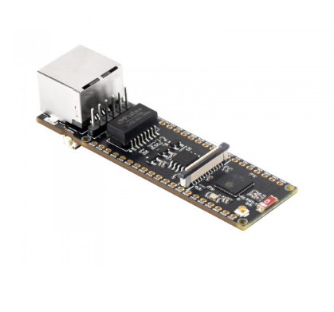

# eth0 — ESP32-S3 Network Security Tool

> Promiscuous Ethernet capture, packet injection, intrusion detection,
> and active recon/attack tooling on a $25 board.

[](LICENSE)

eth0 turns a Waveshare ESP32-S3-ETH into a portable network probe that
captures every Ethernet frame on the wire to PCAP, runs an inline IDS,
and can inject crafted packets, perform ARP MitM, spoof DNS, scan
ports, fingerprint operating systems, and more — all from a serial
console at 460 800 baud or from the bundled Web Serial UI.



---

## ⚠ Authorized use only

This is an **offensive security tool**. By building, flashing, or
running this firmware you agree that you are only using it on
networks you own or have explicit written authorization to test.
See [`SECURITY.md`](SECURITY.md) for the full responsible-use
disclaimer.

---

## Hardware

- **Waveshare ESP32-S3-ETH** (ESP32-S3 + WIZnet W5500 + microSD)
- USB-C cable
- microSD card formatted FAT32 (8–32 GB)
- Ethernet cable

Pinout, board options, and BOM in [`docs/HARDWARE.md`](docs/HARDWARE.md).

---

## Quickstart

1. Install **Arduino IDE 2.x** and the ESP32 board package
   (`esp32:esp32@2.0.17`).
2. Install the two required libraries via the Library Manager:
   `Adafruit NeoPixel @ 1.12.3` and `Ethernet2 @ 1.0.4`.
3. Open `eth0/eth0.ino` in the IDE.
4. Set **Tools → Board → ESP32S3 Dev Module** with the menu options
   listed in [`docs/HARDWARE.md`](docs/HARDWARE.md).
5. Upload, then open the Serial Monitor at **460 800 baud**.

You should see:

```
  ┌─────────────────────────────────────────┐
  │         eth0 — Network Security Tool     │
  │     ESP32-S3-ETH  /  W5500 + SD Card    │
  └─────────────────────────────────────────┘
[ETH] DHCP OK! IP: 192.168.50.187 ...
[CAPTURE] Started.
```

Type `help` to see every command.

For headless / CI builds, the same toolchain runs under `arduino-cli`
— see [`CONTRIBUTING.md`](CONTRIBUTING.md).

---

## Features

eth0 has 30+ commands grouped into capture, recon, attack, services
and identity. The full reference lives in
[`docs/FEATURES.md`](docs/FEATURES.md). Highlights:

| Category | Commands |
|---|---|
| **Capture** | `s` toggle, `f` filter (proto / port / ip / mac), 10 MB rotating PCAP files on SD |
| **Recon** | `recon sweep [/16-/30]`, `recon ports`, `recon scan` (handshake + banner), `recon vlan`, `recon stp`, `recon lldp`, `recon mdns`, `recon netbios`, `recon fingerprint` |
| **Inject** | `send arp`, `send ping`, `send udp`, `send raw <hex>` |
| **IDS** | ARP spoof / rogue DHCP / cleartext creds / DNS anomaly / port-scan detection, NeoPixel alert states, syslog forwarding |
| **Attacks** | `mitm`, `dnsspoof`, `kill` (TCP RST), `dhcpstarve`, `poison` (NBNS/LLMNR), `mac` (spoof/auto-rotate) |
| **Covert** | `tunnel` (AES-128-CBC over UDP), `covert dns send` |
| **Services** | minimal IRC server (RFC 1459), TP-Link Kasa device query |
| **Visualisation** | `map` (unified network view), `stats`, `hexdump`, browser-based Web Serial UI |

---

## Architecture

The firmware is split into ~35 single-purpose source modules under
`eth0/`. The diagram and per-module dependencies are in
[`docs/ARCHITECTURE.md`](docs/ARCHITECTURE.md). The C++ style is
documented in [`docs/STYLE.md`](docs/STYLE.md). The wire-format
specs for the Kasa, IRC, AES tunnel, and DNS covert channel are in
[`docs/PROTOCOLS.md`](docs/PROTOCOLS.md).

---

## Development

- **Build / format / test**: see [`CONTRIBUTING.md`](CONTRIBUTING.md)
- **Hardware setup**: see [`docs/HARDWARE.md`](docs/HARDWARE.md)
- **Style guide**: see [`docs/STYLE.md`](docs/STYLE.md)
- **Changelog**: see [`CHANGELOG.md`](CHANGELOG.md)
- **Reporting vulnerabilities**: see [`SECURITY.md`](SECURITY.md)

CI runs on every push:

| Workflow | Tool | Coverage |
|---|---|---|
| `build` | `arduino-cli` (esp32s3) | Full firmware compile against pinned core + libs |
| `host-tests` | `g++` | Pure-function unit tests for parseIP, parseMAC, ipChecksum, dnsDecodeName, CIDR math |

---

## License

Apache License 2.0 — see [`LICENSE`](LICENSE).

Third-party library attributions are in [`NOTICE`](NOTICE).
